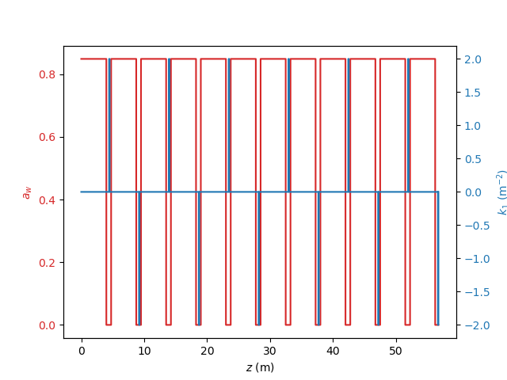
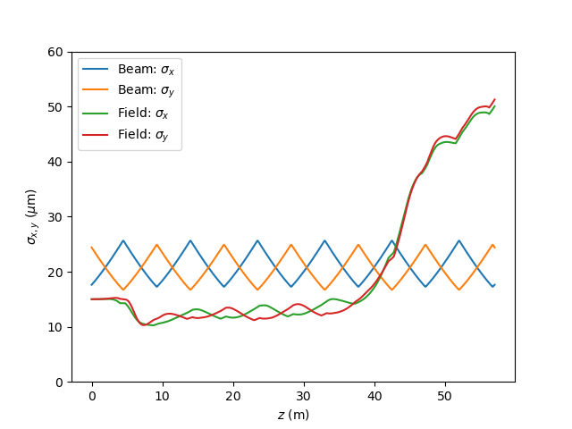
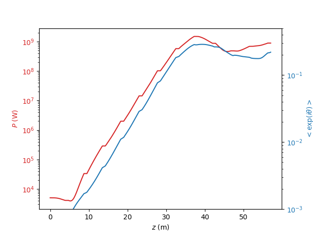

## Example 1 : Steady-State Simulation
**Note:** The steady-state simulation in this directory is part of automatic testing via GitHub Actions. If you change something be sure to check afterwards that script `TEST_power.py` gives "OK" status.

*All files for running the example are found in the subdirectory examples/Example1-SteadyState of the source code distribution*

Steady-state simulations are the simplest form to run Genesis, where the variation along the electron bunch and radiation field is assumed constant. Field distribution,
which slips out of the electron slice is replaced with an identical field, slipping in. Internally, Genesis disables any slippage and it is sufficient to simulate only a single slice with the length of the
wavelength of interest. Note this is identical to a single frequency model.

In the following the setup input and lattice file are explained in some detail. Since this is the first example it starts from scratch.

#### Lattice File

The lattice file contains the physical definition of the undulator beamline, including the types, their position and strengths.
The example follows the lattice of the SwissFEL hard X-ray beamline Aramis, which places undulator modules in a FODO lattice.

The first is to define the undulator module, which is used for all instances in the lattice. The given line in thelattice file is


```asm
UND: UNDULATOR = { lambdau=0.015000, nwig=266, aw=0.84853, helical= True};
```

The tag **UND** is a label to used to refer latter in the file to this element. The type is defined by the keyword **UNDULATOR** followed by a list of
parameters, placed in a curly bracket. Here the undulator period is 15 mm, the module has 266 undulator periods, 
and the rms undulator parameter is 0.84853. The undulator has a helical configuration.

```asm
QF: QUADRUPOLE = { l = 0.080000, k1= 2.000000 };
QD: QUADRUPOLE = { l = 0.080000, k1= -2.000000 };
```
Next, two quadrupoles are defined with opposite polarity. A positive value means that the beam is focussed in the x-plane.
The field strength are normalized (independent from the explicit electron beam energy) and has the unit of inverse meter squared.
An estimate of the focal strength is f = 1/k1*l. With a length of 8 cm it is in this case 6.25 m.

```asm
D1: DRIFT = { l = 0.44};
D2: DRIFT = { l = 0.24};
```
Two drift lengths of 44 and 24 cm respectively defines the space before and after the quadrupole.

The explicit layout is defined with the **LINE** command: a list of basic elements (e.g. undulator, quadrupoles) or other lines.
(Note Genesis 1.3 allows only a recursion depth of 10, where a line is placed as an element of an outline). The basic
arrangement is: Undulator Module - Drift - Focusing Quadrupole - Drift - Undulator Module - Drift - Defocusing Quadrupole Drift

```asm
FODO: LINE={UND,D1,QF,D2,UND,D1,QD,D2};
```

The label of this subsection of the full beamline is FODO. In the full beamline, the FODO lattice has 6 periodic cells.
```asm
FEL: LINE={6*FODO};
```

The multiplier before an element acts the same has explicitly as writing the same element several times. Thus the statement above is identical to 
**FEL: LINE={FODO,FODO,FODO,FODO,FODO,FODO};**

This completes the definition of the lattice file. Note that the total length of the FODO cell is 9.5 m, which is needed in the main input file.

#### Input File

The main input file is a list of namelist, which are processed in the order they appear in the file. IT is necessary that the first namelist is &setup,
defining some key parameters for the simulation
```asm
&setup
rootname=Example1
lattice=Example1.lat
beamline=FEL
lambda0=1e-10
gamma0=11357.82
delz=0.045000
shotnoise=0
nbins = 8
&end
```
The **rootname** is used for any output file, starting with the string given here. In this case themain output file would be
Example1.out.h5
The **lattice* parameter defines the file, which describes the beamline elements. This file has been discussed above.
The element **beamline** selects one line in the lattice file to be used for simulation. This allows to have several variants in the lattice file.
Setting this to **beamline=FODO** would actually use only a single FODO cell with two undulator modules instead the 6 cells of the full lattice.
Genesis needs two reference values for the reference wavelength **lambda0** and reference energy **gamma0**.
These do not have necessarily be the FEL wavelength (In SASE simulations) or the electron beam energies, but should not diviates too much for not violating the
resonant approximation of the underlying numerical model. **delz* is the preferred integration step size (here about 3 undulator periods in one step) though
genesis will align the step size for each step to resolve each beamline elements correctly.
Since this is a steady state simulation the impact of the fluctuation in the electron position should be disabled (shotnoise) by setting **shotnoise** to zero. In time-dependent simulation (SASE simulation) this should be set to one though.
The last parameter **nbins** defines the number of particles per beamlet, which is a group of macro particles which share the same coordinate, except for their longitudinal position.
.

For injecting the electron beam into the lattice, the optical function should be defined when initializing the electron beam.
However, Genesis can be calculated the match solution to the lattice with the **lattice** namelist.
```asm
&lattice
zmatch=9.5
&end
```
**zmatch** defines the length over which a periodic solution is assumed. Note that 9.5 is the same value as we calculated 
for the length of the basic FODO cell in the lattice file.

Next is the definition of the radiation field for the start of the simulation. Since this is a steady-state simulation
it should have some radiation power.
```asm
&field
power=5e3
dgrid=2.000000e-04
ngrid=255
waist_size=30e-6
&end
```
Here the starting power is 5 kW and the field has a size of 30 microns. The physical meaning of **waist_size**
is the same as w0 for a fundamental Gauss mode. With the wavelength (here **xlambda0** from setup namelist) and the waist size
the radiation wavefront is well defined.
the wavefront is then placed on a 2D grid with **255** grid points in each direction and an 
extension between -200 to 200 microns.  Note that it is strongly recommended having an odd number of grid points to have the origin
of the two grid coincide with the transverse position x=0 and y=0.

The electron beam is generated with:
```asm
&beam
current=3000
delgam=1.000000
ex=4.000000e-07
ey=4.000000e-07
&end
```
Here the beam has a current of 3 kA, an RMS energy spread of 0.511 MeV (**delgam**=1)
and normalized emittances of 400 nm in x and y.  Note that the mean beam energy is taken from **setup** and
the optical twiss parameters from the matching command in **lattice**. However, one can overwrite the values here if needed.

So far the input file has the basic set-up, did a matching to the lattice and generated one radiation wavefront and
one slice of electron distribution, it can be tracked now:

```asm
&track
&end
```

## Output

Running the example with ```genesis4 Example1.in``` should be quite fast. The output should look like:
```
---------------------------------------------
GENESIS - Version 4.6.3 (beta) has started...
Compile info: Compiled by reiche at 2023-09-11 14:11:39 [UTC] from Git Commit ID: 4cc8ca48f6a42375139a1e4f7dd13306e5751d34
Starting Time: Mon Sep 11 17:16:53 2023

MPI-Comm Size: 1 node

Parsing lattice file...
Matching for periodic solution between z = 0 and z = 9.5 :
   betax (m) : 8.82088
   alphax    : -0.724138
   phix (deg): 44.4024
   betay (m) : 16.9039
   alphay    : 1.36263
   phiy (deg): 47.1917
Generating input radiation field for HARM = 1 ...
Generating input particle distribution...

Running Core Simulation...
Steady-state run
Initial analysis of electron beam and radiation field...
  Calculation: 0% done
  Calculation: 10% done
  Calculation: 20% done
  Calculation: 30% done
  Calculation: 40% done
  Calculation: 50% done
  Calculation: 60% done
  Calculation: 70% done
  Calculation: 80% done
  Calculation: 90% done
  Calculation: 100% done
Writing output file...

Core Simulation done.
End of Track

Program is terminating...
Ending Time: Mon Sep 11 17:17:22 2023
Total Wall Clock Time: 29.5481 seconds
-------------------------------------

```
The python script ```Example1.py``` will parse the output file and can be used as a template on how read the output file.
To run the script python should have the packages **matplotlib** and **h5py** installed.
The generated figure should be identical to the following plots.

#### Lattice


Main undulator field and quadrupole is displayed.

#### Beam and Field Sizes



While the electronbeam has the typical alternating oscillation in its beam size due to the FODO lattice, the radiation field starts with 15 micron
(note this should be half of the value **waist_size** in the input deck) but get smaller due to gain guiding.
Around 40 m the FEL process reaches saturation and the radiaiton field starts to diverge.

#### Radiation Power and Bunching



In this log plot one can see the growth of the radiation power and bunching factor till saturation is reached around 40 m.
Note that the little dip in power at around 5 m could be optimize by tuning the FEL. This canbe done either by **gamma0** in the setup namelist
or the value for **aw** in the lattice file.

