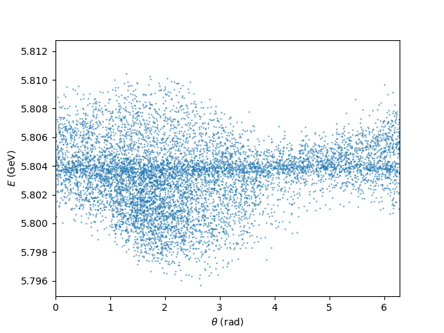

## Example 2 : Particle and Field Dumps

*All files for running the example are found in the subdirectory examples/Example1-SteadyState of the source code distribution*

The internal data of genesis is represented by wavefronts for the fields and the 6D particle distribution for electrons. They contain more information than the output of the main output file. 
Genesis supports to export the information to external files,also called dumps.

There are three methods to enforce dumps. In the following example, all three are used for illustration.

#### Markers

Markers in the lattice file can trigger the output of either field or particle distribution. To enable output the 
lattice file from Example1.lat is modified with these lines (replacing the previous definition of the FODO cell of example 1):

```asm
M: MARKER = {dumpfield = 1};
FODO: LINE={UND,D1,QF,D2,UND,D1,QD,D2,M};
```

Markers are zero length element and do not add to the total length of the lattice. In this case the Marke ris added to the end of the FODO cell.
With 6 cells in the full lattice there will be 6 filed dumps. They are named with the root name and have the extension 
```.fld.h5```. To differentiate the different outputs the name has also the integration step number in between the rootname and the extension (e.g.
```Example2.184.fld.h5```)

#### Dumps Outside of Tracking

The namelist **write** in the main input file can write the field or particle distribution at any point outside of the tracking.
In the example the input file has the instruciton
```asm
&write
field = dump
&end
```
To write the field distribution with the name ```dump.fld.h5```. The extension are added automatically as with the marker.
Since Genesis has executed the tracking before, the field distribution represent the stat at the end of the tracked beamline. In our case this is the end of the undulator.

#### Periodic Output While Tracking

The last methods is to define in the track namelist the number of integration steps after which a dump is issued.
The track name list is modified to 

```asm
&track
beam_dump_step = 2
&end
```
As for markers the output includes the integration step in its filenmae. In this example the output is done after every second integration step. In total about 600 files will
be generated with this method.

Note that generating dumps at each step can cause to a large number of files. In particular for time-dependent runs (See later examples)
the size per dump can be large (a few GByte) and generating hundrets of them can quickly cause problems with the available hard disk space.

## Output

Running ```Example2.in``` causes the additional output when ever a dump file is generated. Also for a better illustraiton of the output, the
energy spread of the beam has been reduced to 
```asm
delgam=0.100000
```
for a better display of the FEL process.

The python script ```Example2.py``` can be used as a guidance on how to read the dump files and e.g. convert the wavefront into a 2D intensity distribution.


#### Wavefront


Wavefront distribution after the first 4 FODO cells. Note that the output seems noisy, which comes from the limited number of macro particles in the simulation and 
the reduced diffraction in the Angstrom wavelength regime. 

#### Longitudinal Phasespace Distribution



Snapshot of the longitudinal phase space of the electron beam towards the end of the undulator beamline. The x-axis coordinate is the ponderomotive phase,
which is given by the lontidutinal position mulitplied with the wavenumber of the resonant wavelength. In this case is corresponds for a slice thickness of 1 Angstrom.

#### Electron Beam Animation

With the dump of the electron phase space after every second integration step, the python script generates two animation. One for the longitudinal phase space, similar to the plot above. 
the other is the distribution in the horizontal plane. The file are in mp4 format and it might be that they need to be downloaded first to display them.


Here the formation of the micro bunching can be seen with its initial modulation in energy to roughly a quarter rotation in phase space. A significant part of electrons are not modulated.
These corresponds for electrons with large betatron amplitude, which cannot stay in resonance with the radiation field.


The breathing in the transverse size comes from the focusing of the FODO lattice. Note that electrons with large amplitude have the tendency to fall backwards quickly. They cannot stay in resonance and thus do not get modulated in energy.

The small jerks in the animation corresponds to the phase shifter, since in the drift there is a phase velocity mismatch between field and beam. To correct that a phase shifter adjust the phase. In genesis this is done automatically (autophase).
