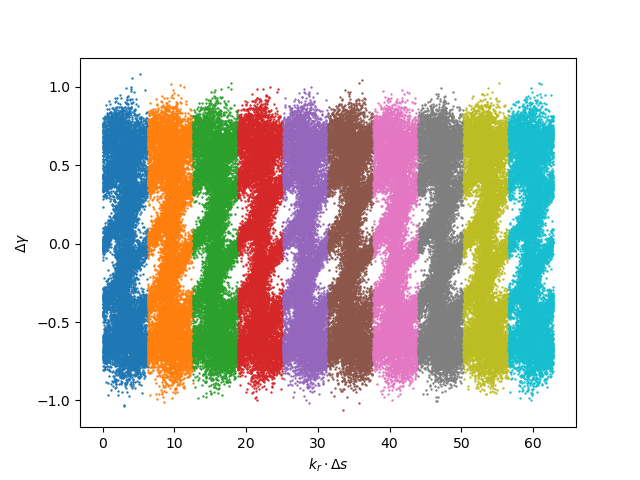
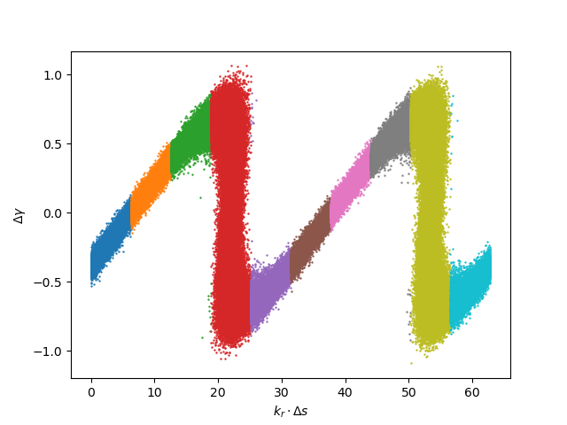
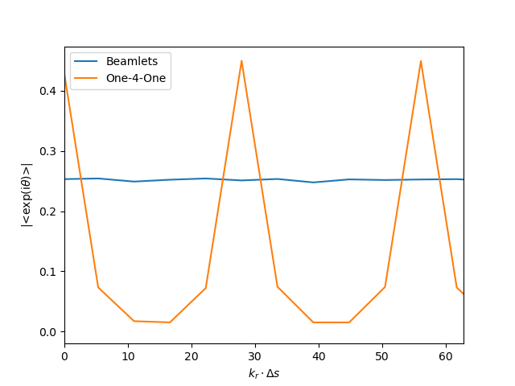
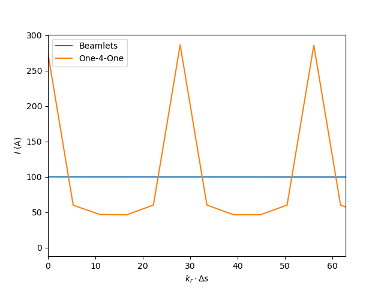
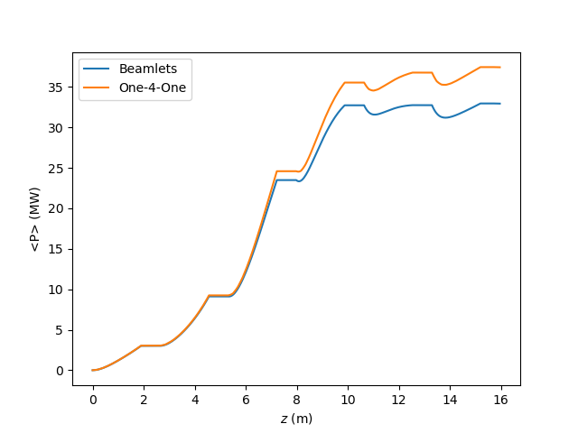
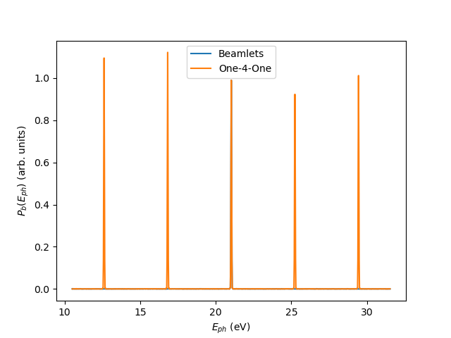
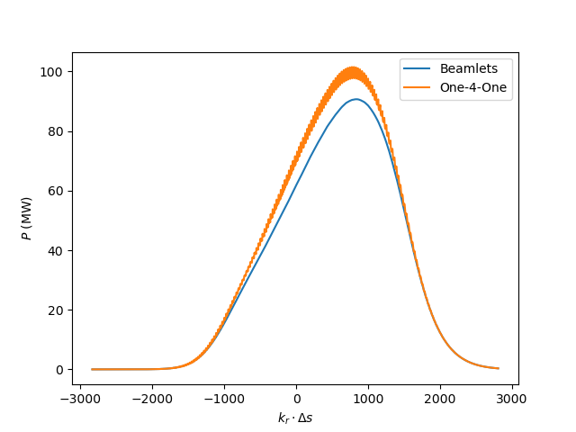
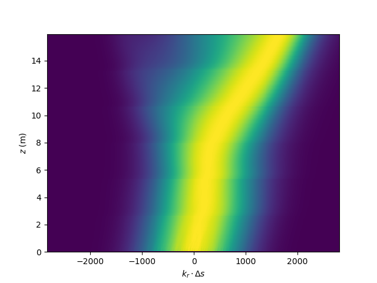
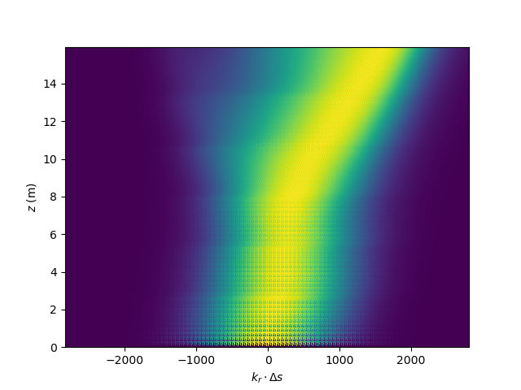

## Example 3 : High Gain Harmonic Generation (HGHG) Simulation

*All files for running the example are found in the subdirectory examples/Example4-HGHG of the source code distribution*

In high gain harmonic generation the electron beam is modulated in energy by the interaction with an external laser field in an undulator. Due to the intention of this process the undulator is also called modulator.
A succeeding magnetic chicane converts this energy modulation into a modulation of the beam current, creating a series of current spikes. If the duration of the individual spike is shorter than the desired wavelength, it will emit coherently as the harmonic of the external wavelength.
This signal can then be amplified in a long undulator, also called radiator.

### Input File

Modeling this process is rather complex and Genesis allows to replace the first two stages - the energy modulation and the conversion into current spikes - with a simple transformation of the electorn beam distribution using the 
namelist 
```asm
&alter_beam
dgamma=@emod
lambda=265e-9
r56=1.1e-4
&end
```

with a wavelength of the external laser of 265 nm and a R56 strength of the chicane of 0.11 mm.  The applied transformation is solely in the longitudinal plane and does not
consider transverse effects such as the mode size of the external laser or change in the beam optics. 
The longitudinal profile of the external laser is a Gaussian and define by the namelist

```asm
&profile_gauss
label=emod
c0 = 0.7
s0 = 26.5e-6
sig = 20e-6
&end
```
The maximum amplitude of the energy modulation is about 375 keV (or 0.7 in units of the electron rest mass energy) and 7 times larger than the intrinsic energy spread of the electron beam.

Genesis 1.3 has two different methods to run time-dependent simulations: beamlets or one-4one simulations, corresponding to the input files `Example4_a.in` and `Example4_b.in`

#### Beamlet Simulation

In most FEL application the electrons do not move much with respect to the radiation wavelength and emit in a rather small resonant bandwidth of the FEL.
This allows to represent a given slice of the electron beam with a fix number of macro particles. All transverse dimension and the energy are following explicit distributions (e.g. Gaussian) while 
Genesis uses a flat distribution of the longitudinal position, also called the ponderomotove phase. Then these particles are duplicated, each time with a shift in the longitudinal position.
An esemble of macro particles with the same transverse coordinates nad beam energy but distributed in ponderomoted phase 
is called a beamlet. Its size is defined by the input argument `NBINS` in the `setup` namelist.  For the case of `NBINS=4` the beamlet has 4 particles
each separated by 90 degrees in ponderomotive phase.  For the calculation of the bunching factor, which adds up all ponderomotive phase, this equal distribution cancel out perfectly.
This process is also called `Quiet Loading` since it excludes any numerical noise in the bunching factor due to the finite number of particles.
For the correct shot noise, which is the fluctuation in the bunching factor form slice to slice, a shot noise algorithm is applied.
The methode with beamlets, allow to run simulations with much less macro particles than electrons in the bunch. Also it allows for a symmetric load for all cores, independent
on the current for a scalable fast execution of Genesis 1.4 on HPC clusters.

#### One-4-One Simulation

The method of beamlets has its limitation, since it restricts the electrons to a given slice at the generation of the internal particle distribution of Genesis.
This excludes any chance for sorting during the simulation, e.g. when there is a magnetic chicane and due to the variation in energy the 
particles are pushed forward or backward. One example is Echo-enabled Harmonic Generation where in the first stage electrons are shifted by tens of wavelengths.
To overcome this limitation it is possible to simulate each individual electrons by enabling the `one4one` parameter to1 in teh `setup` namelist.
the penality that the execution time gets longer, which could be compensated by requesting more modes.

### Output

#### Particle Distribution




Both plots shows the longitudinal particle distribution around 10 slices, centered around the peak of the electron beam current. The upper uses the beamlet approach, while the lower is generated with 
one-4one methods. The one-4-one represent directly what one expects form HGHG to center many particles within one radiation slice.
The beamlet result has a strong substructure but is very similar from slice to slice. In fact, it is the results of applying a modulus operation of the lower plot over 5 slices and fold the particle back into one slice.

This difference is also shown in the corresponding bunching factors and current profiles for the same slices.




While the beamlet approach is smooth in the current and bunching the spiky behaviour is clearly visible in the one-one simulation.
The maximum bunching is about 42 % while the region between the current spikes has a low bunching factor of about 5 %. 
Note that one multiplies the values for the bunching factor and the current of the one-one simulation and average over 5 slices one obtain directly the "smooth" results of the beamlet approach.

#### FEL Performance

The evolution of the average power is shown in

where the case of one-4-one simulation shows an excess of radiation power, noticeably visible in the saturation regime. This has two reasons.
first, the one-4-one case shows also the other harmonics of the external laser. Since the drive laser is at 265 nm, this corresponds to sidebands with a spacing of about 4.7 eV in the spectrum of the initial bunching:


Note that the central line is identical for both case sbut the sidebands are only present in the one-4-one case.
Thus the simulation is effectively seeded with more power than the central beamline, albeit the gain at these outlier frequencies are greatly reduced.

The other effect is that the profile in the one-4one case is rippled since every 5th wavelength there is a strong emitter (namely the induced current spike) which a slightly larger radiation field.
In the beamlet approach this is averaged out and the field profile is smooth. This causes a slight difference in the saturation regime since the enhance field can drive
the strong superradiant regime since a larger radiation separatix slips over the electron beam with the ability to temporarily extract more energy from the electron beam.
The is explicitly suppressed in the beamlet approach.



In the normalized 2D radiaiton power plot along the undulator and bunch frame, the difference is visible.
Note that only after 5 periods the one-4one case has a smooth distribution, since the field has in this case slipped over a mulitple of the external laser wavelength.




In general, it is hard to say which methods is to use. Often the beamlet delivers good results in particular in the case of saturation length and main spectral line.
Also in this case the current was lowered to have reasonable execution times of both cases. While for hard X-rays cases the number of macro particles and number of electrons to be modelled per slice is very similar and
a one-4-one approach is not a strong drawback, at longer wavelength the execution times differ. 
This example is to illustrate the use of one-4-one simulations which at a certain point must differ from the smooth beamlet simulation.
this is in particular the case for harmonic generhation where the external laser wavelength is larger than the cooperation length of the FEL. This is equivalent to have a strong amplification of the sidebands and thus preserving the ripple structure of the FEL signal.