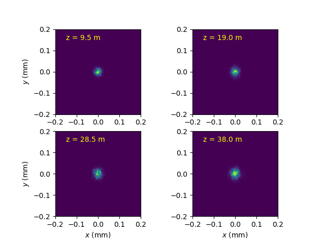
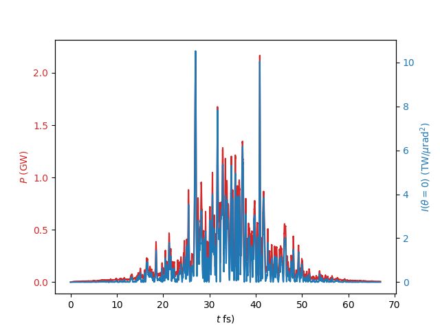

# Examples
## Example 1
In [Example 1](Example1-SteadyState/), we start from scratch with a steady-state simulation. The evolution of selected beam and field parameters is plotted. 

## Example 2
In [Example 2](Example2-Dumps/), field and beam dumps are added to the simulation.

## Example 3
In [Example 3](Example3-TimeDependent/), the simulation is extended to time-dependent simulations with the demonstration of profiles to describe any temporary dependence in beam or field parameters

## Example 4
In [Example 4](Example4-HGHG/), we explore the difference in one-4-one simulation and beamlet simulation in time-dependent simulation, where the beam interaction alters the electron distribution on a macroscopic level.
Examples are HGHG and EEHG cases, where the energy modulation and energy-dependent run-time differences in chicanes can shift electrons faraway from their original location, well beyond the wavelength of the FEL.

