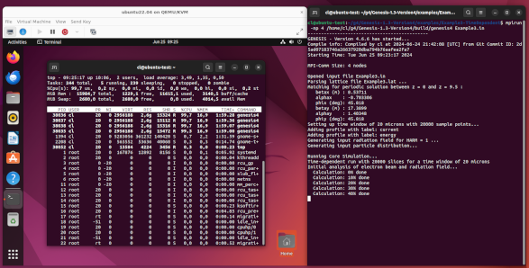

# Ubuntu 22.04LTS
Christoph Lechner, European XFEL, 2024-06-25

## Installing the needed packages
Starting with a fresh "normal installation" of Ubuntu 22.04LTS (DVD image: `ubuntu-22.04.4-desktop-amd64.iso`).

Installing the following packages and their dependencies:

```
sudo apt-get install build-essential
sudo apt-get install cmake
sudo apt-get install git
sudo apt-get install libopenmpi-dev
sudo apt-get install libhdf5-openmpi-dev
sudo apt-get install pkg-config
```

In the directory, you can find the output of `dpkg -l`, listing all installed software packages.

### Remark, 2024-07-30
If you plan to use features such as computation of field divergence angles, you need to ensure that also the FFTW3 library is available.
Install the following package:
```
sudo apt-get install libfftw3-dev
```

## Building "Genesis 1.3"
Now, clone "Genesis 1.3" from the git repository.
One can compile "Genesis 1.3" as described in the manual.

After the preparation phase, the output of `cmake` is the following (if FFTW3 is not available):
```
cl@ubuntu-test:~/g4/Genesis-1.3-Version4$ mkdir build
cl@ubuntu-test:~/g4/Genesis-1.3-Version4$ cd build
cl@ubuntu-test:~/g4/Genesis-1.3-Version4/build$ cmake -DCMAKE_BUILD_TYPE=Release ..
-- The CXX compiler identification is GNU 11.4.0
-- The C compiler identification is GNU 11.4.0
-- Detecting CXX compiler ABI info
-- Detecting CXX compiler ABI info - done
-- Check for working CXX compiler: /usr/bin/c++ - skipped
-- Detecting CXX compile features
-- Detecting CXX compile features - done
-- Detecting C compiler ABI info
-- Detecting C compiler ABI info - done
-- Check for working C compiler: /usr/bin/cc - skipped
-- Detecting C compile features
-- Detecting C compile features - done
-- h5pcc not found - looking for basic compiler
-- C++ Compiler: /usr/bin/c++
-- C Compiler: /usr/bin/cc
-- Found MPI_C: /usr/lib/x86_64-linux-gnu/openmpi/lib/libmpi.so (found version "3.1") 
-- Found MPI_CXX: /usr/lib/x86_64-linux-gnu/openmpi/lib/libmpi_cxx.so (found version "3.1") 
-- Found MPI: TRUE (found version "3.1")  
-- MPI Found
-- Found HDF5: /usr/lib/x86_64-linux-gnu/hdf5/openmpi/libhdf5.so;/usr/lib/x86_64-linux-gnu/libcrypto.so;/usr/lib/x86_64-linux-gnu/libcurl.so;/usr/lib/x86_64-linux-gnu/libsz.so;/usr/lib/x86_64-linux-gnu/libz.so;/usr/lib/x86_64-linux-gnu/libdl.a;/usr/lib/x86_64-linux-gnu/libm.so (found version "1.10.7")  
-- HDF5 Found
-- Version: 1.10.7
-- Parallel HDF5 supported
-- Found PkgConfig: /usr/bin/pkg-config (found version "0.29.2") 
-- FFTW not found
-- Excluding FFTW specific source code
-- Build Info:
-- C++ Compiler: /usr/bin/c++
-- C Compiler: /usr/bin/cc
-- CMAKE_C_FLAGS: 
-- CMAKE_CXX_FLAGS: '-lstdc++'
-- Used libraries: MPI::MPI_C;HDF5::HDF5
-- Configuring done
-- Generating done
-- Build files have been written to: /home/cl/g4/Genesis-1.3-Version4/build
```

Now, starting the build process:
```
cl@ubuntu-test:~/g4/Genesis-1.3-Version4/build$ make
[  1%] Generating include/version.h, ALL
-- Git hash is 2d5ad07183746a26637920dba794b76aafea2fa7
[  1%] Built target get_git_hash
[  3%] Building CXX object CMakeFiles/genesis13.dir/src/Util/BesselJ.cpp.o
[..]
[ 96%] Built target genesis13
[ 98%] Building CXX object CMakeFiles/genesis4.dir/src/Main/mainwrap.cpp.o
[100%] Linking CXX executable genesis4
[100%] Built target genesis4
cl@ubuntu-test:~/g4/Genesis-1.3-Version4/build$
```

## Running "Genesis 1.3"
### Modifying Example3
Modifying `Example3.in` file to reduce the resource footprint (the virtual PC only has 4 CPU cores and a total of 16GBytes of RAM):
```
diff --git a/examples/Example3-TimeDependent/Example3.in b/examples/Example3-TimeDependent/Example3.in
index d39ddaf..9ceed2c 100644
--- a/examples/Example3-TimeDependent/Example3.in
+++ b/examples/Example3-TimeDependent/Example3.in
@@ -19,7 +19,7 @@ zmatch=9.5
 
 &time
 slen = 20e-6
-sample = 3
+sample = 10
 &end
 
 &profile_gauss
@@ -38,7 +38,7 @@ c1=1e7.
 &field
 power=0
 dgrid=2.000000e-04
-ngrid=255
+ngrid=101
 waist_size=30e-6
 &end
 
@@ -52,5 +52,6 @@ ey=4.000000e-07
 
 &track
 output_step=3
+zstop=0.5
 &end
```

### Running the simulation
Running modified Example3 on the virtual PC:
```
cl@ubuntu-test:~/g4/Genesis-1.3-Version4/examples/Example3-TimeDependent$ mpirun -np 4 /home/cl/g4/Genesis-1.3-Version4/build/genesis4 Example3.in
```


[](g4_running.png)

As one can see in the screenshot (click to enlarge), there are 4 processes of `genesis4`, each one at 100% CPU load.

## Final remarks 
After running the simulation, you may want to explore the generated HDF5 output files, for instance using `h5ls`. For this you need to install the package `hdf5-tools`.


